# ERD --- Dagana Platform

> **Dokumen Teknis**
> **Modul:** ERD & Database Design v0.1
> **Acuan:** `Dagana_PRD_v0.1.md`, `docs/domain-modeling.md`
> **Database:** PostgreSQL
> **Status:** Draft untuk migration baseline (Phase 0)

---

## Table of Contents

1. [Aturan Umum Schema](#1-aturan-umum-schema)
2. [Diagram ERD](#2-diagram-erd)
3. [Catatan RLS & Isolasi Tenant](#3-catatan-rls--isolasi-tenant)
4. [Daftar Tabel per Modul](#4-daftar-tabel-per-modul)
5. [Indeks yang Direkomendasikan](#5-indeks-yang-direkomendasikan)
6. [Convention & Constraint](#6-convention--constraint)

---

## 1. Aturan Umum Schema

-   Nama tabel: **snake_case, jamak** — `product_variants`, `stock_movements`.
-   Primary key setiap tabel: `id uuid PRIMARY KEY` (menghasilkan UUID v7).
-   `tenant_id` pada semua tabel business: `uuid` + `TIMESTAMPTZ created_at`, `updated_at` di mana relevan.
-   `money` menggunakan `numeric(15,2)`; quantity stok `numeric(15,3)` (mendukung unit berat seperti kg).
-   Kolom JSON (`jsonb`) untuk snapshot & konfigurasi.
-   Foreign key aktif (`ON DELETE RESTRICT` untuk data bisnis, `CASCADE` hanya untuk relasi bawaan seperti `order_items → orders`).
-   Konvensi status menggunakan enum PostgreSQL (`CREATE TYPE ... AS ENUM`).

---

## 2. Diagram ERD

```mermaid
erDiagram
    TENANTS ||--o{ OUTLETS : "memiliki"
    TENANTS ||--o{ ROLES : ""
    TENANTS ||--o{ CATEGORIES : ""
    TENANTS ||--o{ PRODUCTS : ""
    TENANTS ||--o{ MODIFIER_GROUPS : ""
    TENANTS ||--o{ LOW_STOCK_RULES : ""
    TENANTS ||--o{ DISCOUNT_RULES : ""
    TENANTS ||--o{ TAX_RATES : ""
    TENANTS ||--o{ PAYMENT_METHODS : ""
    TENANTS ||--o{ CUSTOMERS : ""
    TENANTS ||--o{ MEMBERSHIPS : ""
    TENANTS ||--o{ NOTIFICATIONS : ""

    USERS ||--o{ MEMBERSHIPS : ""
    USERS ||--o{ OUTLET_ASSIGNMENTS : ""
    USERS ||--o{ SESSIONS : ""

    ROLES ||--o{ ROLE_PERMISSION : ""
    PERMISSIONS ||--o{ ROLE_PERMISSION : ""

    OUTLETS ||--o{ OUTLET_ASSIGNMENTS : ""
    OUTLETS ||--o{ MENU_ITEMS : ""
    OUTLETS ||--o{ STOCKS : ""
    OUTLETS ||--o{ STOCK_MOVEMENTS : ""
    OUTLETS ||--o{ STOCK_RECEIVINGS : ""
    OUTLETS ||--o{ STOCK_OPNAMES : ""
    OUTLETS ||--o{ ORDERS : ""
    OUTLETS ||--o{ TRANSACTIONS : ""
    OUTLETS ||--o{ PAYMENTS : ""
    OUTLETS ||--o{ TABLES : ""
    OUTLETS ||--o{ TABLE_SESSIONS : ""
    OUTLETS ||--o{ DAILY_SALES_SUMMARIES : ""

    CATEGORIES ||--o{ PRODUCTS : ""
    CATEGORIES ||--o{ CATEGORIES : "parent"

    PRODUCTS ||--o{ PRODUCT_VARIANTS : ""
    PRODUCTS ||--o{ MENU_ITEMS : ""

    MODIFIER_GROUPS ||--o{ MODIFIER_OPTIONS : ""

    PRODUCT_VARIANTS ||--o{ STOCKS : ""
    PRODUCT_VARIANTS ||--o{ STOCK_MOVEMENTS : ""
    PRODUCT_VARIANTS ||--o{ STOCK_ADJUSTMENTS : ""
    PRODUCT_VARIANTS ||--o{ LOW_STOCK_RULES : ""
    PRODUCT_VARIANTS ||--o{ ORDER_ITEMS : ""

    STOCK_OPNAMES ||--o{ STOCK_ADJUSTMENTS : ""

    ORDERS ||--o{ ORDER_ITEMS : ""
    ORDERS ||--o{ TRANSACTIONS : ""

    TRANSACTIONS ||--o{ TRANSACTION_ITEMS : ""
    TRANSACTIONS ||--o{ PAYMENTS : ""
    TRANSACTIONS ||--o{ REFUNDS : ""

    PAYMENT_METHODS ||--o{ PAYMENTS : ""
    PAYMENTS ||--o{ REFUNDS : ""

    CUSTOMERS ||--o{ ORDERS : ""

    TABLES ||--o{ TABLE_QRS : ""
    TABLES ||--o{ TABLE_SESSIONS : ""
    TABLE_SESSIONS ||--o{ ORDERS : ""

    TENANTS {
        uuid id PK
        varchar name
        varchar slug UK
        varchar status
        varchar plan
        timestamptz created_at
        timestamptz updated_at
    }
    OUTLETS {
        uuid id PK
        uuid tenant_id FK
        varchar name
        text address
        varchar business_type
        varchar status
        timestamptz created_at
        timestamptz updated_at
    }
    USERS {
        uuid id PK
        varchar name
        varchar email UK
        varchar password_hash
        varchar status
        timestamptz created_at
        timestamptz updated_at
    }
    ROLES {
        uuid id PK
        uuid tenant_id FK
        varchar code
        varchar name
    }
    PERMISSIONS {
        uuid id PK
        varchar code UK
        varchar description
    }
    ROLE_PERMISSION {
        uuid role_id PK, FK
        uuid permission_id PK, FK
    }
    MEMBERSHIPS {
        uuid id PK
        uuid user_id FK
        uuid tenant_id FK
        uuid role_id FK
        varchar status
    }
    OUTLET_ASSIGNMENTS {
        uuid id PK
        uuid user_id FK
        uuid tenant_id FK
        uuid outlet_id FK
        varchar status
    }
    SESSIONS {
        uuid id PK
        uuid user_id FK
        varchar token UK
        varchar refresh_token UK
        timestamptz expires_at
        boolean revoked
    }
    CATEGORIES {
        uuid id PK
        uuid tenant_id FK
        uuid parent_id FK
        varchar name
        int sort_order
    }
    PRODUCTS {
        uuid id PK
        uuid tenant_id FK
        uuid category_id FK
        varchar name
        text description
        varchar image_url
        varchar status
        timestamptz created_at
        timestamptz updated_at
    }
    PRODUCT_VARIANTS {
        uuid id PK
        uuid product_id FK
        varchar sku UK
        varchar barcode UK
        varchar unit
        numeric price
        numeric cost_price
        varchar status
    }
    MODIFIER_GROUPS {
        uuid id PK
        uuid tenant_id FK
        varchar name
        int min_select
        int max_select
        boolean required
        boolean is_active
    }
    MODIFIER_OPTIONS {
        uuid id PK
        uuid modifier_group_id FK
        varchar name
        numeric price_adjustment
    }
    MENU_ITEMS {
        uuid id PK
        uuid outlet_id FK
        uuid product_id FK
        boolean is_active
        int sort_order
    }
    STOCKS {
        uuid id PK
        uuid outlet_id FK
        uuid product_variant_id FK
        numeric quantity
        timestamptz updated_at
    }
    STOCK_MOVEMENTS {
        uuid id PK
        uuid outlet_id FK
        uuid product_variant_id FK
        numeric quantity
        varchar movement_type
        varchar reference_type
        uuid reference_id
        varchar reason
        uuid actor_id FK
        timestamptz created_at
    }
    STOCK_RECEIVINGS {
        uuid id PK
        uuid outlet_id FK
        timestamptz received_at
        text note
        uuid created_by FK
    }
    STOCK_OPNAMES {
        uuid id PK
        uuid outlet_id FK
        timestamptz started_at
        timestamptz completed_at
        varchar status
        uuid created_by FK
    }
    STOCK_ADJUSTMENTS {
        uuid id PK
        uuid outlet_id FK
        uuid product_variant_id FK
        numeric system_qty
        numeric counted_qty
        numeric diff
        varchar reason
        uuid stock_opname_id FK
        uuid created_by FK
        timestamptz created_at
    }
    LOW_STOCK_RULES {
        uuid id PK
        uuid tenant_id FK
        uuid product_variant_id FK
        uuid outlet_id FK
        numeric threshold
    }
    DISCOUNT_RULES {
        uuid id PK
        uuid tenant_id FK
        varchar name
        varchar type
        numeric value
        boolean is_active
    }
    TAX_RATES {
        uuid id PK
        uuid tenant_id FK
        varchar name
        numeric rate
        boolean is_default
    }
    CUSTOMERS {
        uuid id PK
        uuid tenant_id FK
        varchar name
        varchar phone
        varchar email
        text notes
        timestamptz created_at
    }
    ORDERS {
        uuid id PK
        uuid tenant_id FK
        uuid outlet_id FK
        varchar order_number UK
        varchar order_source
        varchar status
        uuid customer_id FK
        uuid table_session_id FK
        varchar idempotency_key UK
        numeric subtotal
        numeric discount_total
        numeric tax_total
        numeric grand_total
        varchar currency
        text note
        uuid created_by FK
        timestamptz created_at
        timestamptz updated_at
    }
    ORDER_ITEMS {
        uuid id PK
        uuid order_id FK
        uuid product_variant_id FK
        varchar product_name
        varchar sku
        numeric unit_price
        numeric quantity
        numeric discount_total
        numeric line_total
        jsonb modifiers_snapshot
    }
    TRANSACTIONS {
        uuid id PK
        uuid tenant_id FK
        uuid outlet_id FK
        uuid order_id FK
        varchar transaction_number UK
        numeric subtotal
        numeric discount_total
        numeric tax_total
        numeric grand_total
        varchar status
        varchar idempotency_key UK
        uuid created_by FK
        timestamptz created_at
    }
    TRANSACTION_ITEMS {
        uuid id PK
        uuid transaction_id FK
        uuid order_item_id FK
        jsonb snapshot
    }
    REFUNDS {
        uuid id PK
        uuid transaction_id FK
        uuid payment_id FK
        numeric amount
        varchar reason
        varchar status
        uuid created_by FK
        timestamptz created_at
    }
    PAYMENT_METHODS {
        uuid id PK
        uuid tenant_id FK
        varchar code
        varchar name
        boolean is_active
        jsonb config
    }
    PAYMENTS {
        uuid id PK
        uuid tenant_id FK
        uuid outlet_id FK
        uuid transaction_id FK
        uuid payment_method_id FK
        numeric amount
        varchar status
        varchar reference
        varchar reference_external
        uuid actor_id FK
        timestamptz paid_at
        timestamptz created_at
    }
    TABLES {
        uuid id PK
        uuid outlet_id FK
        varchar number UK
        int capacity
        varchar area
        varchar status
        timestamptz updated_at
    }
    TABLE_QRS {
        uuid id PK
        uuid table_id FK
        varchar token UK
        boolean is_active
        timestamptz created_at
    }
    TABLE_SESSIONS {
        uuid id PK
        uuid outlet_id FK
        uuid table_id FK
        timestamptz opened_at
        timestamptz closed_at
        varchar status
        uuid created_by FK
    }
    NOTIFICATIONS {
        uuid id PK
        uuid tenant_id FK
        varchar event_type
        jsonb payload
        boolean read
        timestamptz created_at
    }
    DAILY_SALES_SUMMARIES {
        uuid id PK
        uuid outlet_id FK
        date summary_date
        numeric gross_sales
        int transaction_count
        numeric avg_order_value
        timestamptz updated_at
    }
```



---

## 3. Catatan RLS & Isolasi Tenant

Keputusan **D1: Shared schema + RLS**.

```
Tabel ber-tenant_id  →  RLS ENABLE
Policy              →  tenant_id = current_setting('app.current_tenant_id')
                       ATAU via id dari token (setiap request men-set setting)
Tabel global        →  RLS tidak diperlukan (users, permissions, payment_methods)
```

Implementasi:

1.  Setiap request, backend mengeksekusi `SET LOCAL app.current_tenant_id = '<tenant_uuid>'` dalam transaksi.
2.  Policy dibuat otomatis via migration untuk semua tabel `tenant_id`.
3.  Query lintas-tenant **selalu** melampirkan `tenant_id` pada WHERE (lapisan aplikasi + RLS sebagai jaring pengaman).
4.  Post-MVP: fungsi helper untuk generate policy per tabel agar tidak terlewat.

---

## 4. Daftar Tabel per Modul

### Identity & Tenancy

| Tabel | Kolom penting | Relasi |
|---|---|---|
| `users` | name, email (UK), password_hash, status | → memberships, outlet_assignments, sessions |
| `roles` | tenant_id, code, name | → role_permission |
| `permissions` | code (UK), description | → role_permission |
| `role_permission` | role_id, permission_id (**PK gabungan**) | role ↔ permission |
| `sessions` | user_id, token (UK), refresh_token (UK), expires_at, revoked | → users |
| `tenants` | name, slug (UK), status, plan | → outlets, catalog, dll. |
| `outlets` | tenant_id, name, address, business_type, status | → tenant |
| `memberships` | user_id, tenant_id, role_id, status (**UNIQUE user+tenant**) | user ↔ tenant |
| `outlet_assignments` | user_id, tenant_id, outlet_id, status | user ↔ outlet |

### Catalog

| Tabel | Kolom penting | Relasi |
|---|---|---|
| `categories` | tenant_id, parent_id, name, sort_order | self-FK `parent_id` |
| `products` | tenant_id, category_id, name, description, image_url, status | → category, tenant |
| `product_variants` | product_id, sku (UK), barcode (UK), unit, price, cost_price, status | → product |
| `modifier_groups` | tenant_id, name, min_select, max_select, required | → tenant |
| `modifier_options` | modifier_group_id, name, price_adjustment | → modifier_group |
| `menu_items` | outlet_id, product_id, is_active, sort_order (**UNIQUE outlet+product**) | outlet ↔ product |

### Inventory

| Tabel | Kolom penting | Relasi |
|---|---|---|
| `stocks` | outlet_id, product_variant_id, quantity (**UNIQUE outlet+variant**) | → outlet, variant |
| `stock_movements` | outlet_id, product_variant_id, quantity, movement_type, reference_type, reference_id, reason, actor_id | → variant, outlet |
| `stock_receivings` | outlet_id, received_at, note, created_by | → outlet |
| `stock_opnames` | outlet_id, started_at, completed_at, status, created_by | → outlet |
| `stock_adjustments` | outlet_id, product_variant_id, system_qty, counted_qty, diff, reason, stock_opname_id, created_by | → variant, opname |
| `low_stock_rules` | tenant_id, product_variant_id, outlet_id (nullable), threshold | → tenant, variant |

### Sales

| Tabel | Kolom penting | Relasi |
|---|---|---|
| `orders` | tenant_id, outlet_id, order_number (UK), order_source, status, customer_id (nullable), table_session_id (nullable), idempotency_key (**UK per outlet**), subtotal, discount_total, tax_total, grand_total, currency, created_by | → outlet, customer, table_session |
| `order_items` | order_id, product_variant_id, product_name (snapshot), sku, unit_price, quantity, discount_total, line_total, modifiers_snapshot (jsonb) | → order |
| `transactions` | tenant_id, outlet_id, order_id, transaction_number (UK), subtotal, discount_total, tax_total, grand_total, status, idempotency_key, created_by | → order |
| `transaction_items` | transaction_id, order_item_id, snapshot (jsonb) | → transaction |
| `refunds` | transaction_id, payment_id, amount, reason, status, created_by | → transaction, payment |
| `discount_rules` | tenant_id, name, type (`percentage`/`fixed`), value, is_active | → tenant |
| `tax_rates` | tenant_id, name, rate, is_default | → tenant |

### Payments

| Tabel | Kolom penting | Relasi |
|---|---|---|
| `payment_methods` | tenant_id (nullable = global), code (`CASH`/`QR`/`TRANSFER`/`DEBIT`/`CREDIT`), name, is_active, config (jsonb) | → tenant |
| `payments` | tenant_id, outlet_id, transaction_id, payment_method_id, amount, status (`PENDING`/`PAID`/`FAILED`/`REFUNDED`), reference, reference_external, actor_id, paid_at | → transaction, method |

### Customers

| Tabel | Kolom penting | Relasi |
|---|---|---|
| `customers` | tenant_id, name, phone, email, notes | → tenant |

### Tables & Ordering

| Tabel | Kolom penting | Relasi |
|---|---|---|
| `tables` | outlet_id, number (UK), capacity, area, status | → outlet |
| `table_qrs` | table_id, token (UK, hash), is_active | → table |
| `table_sessions` | outlet_id, table_id, opened_at, closed_at, status, created_by | → table |

### Notifications & Reporting

| Tabel | Kolom penting | Relasi |
|---|---|---|
| `notifications` | tenant_id, event_type, payload (jsonb), read | → tenant |
| `daily_sales_summaries` | outlet_id, summary_date, gross_sales, transaction_count, avg_order_value (**UNIQUE outlet+date**) | → outlet |

---

## 5. Indeks yang Direkomendasikan

### Wajib (uniqueness & FK hot-path)

```sql
-- Uniqueness
UNIQUE (tenant_id, slug)                        -- tenants
UNIQUE (user_id, tenant_id)                     -- memberships
UNIQUE (outlet_id, product_variant_id)          -- stocks
UNIQUE (outlet_id, number)                      -- tables
UNIQUE (outlet_id, summary_date)                -- daily_sales_summaries

-- Uniqueness idempotency (offline sync)
UNIQUE (outlet_id, idempotency_key)   -- orders, transactions

-- Vendor/identitas unik
UNIQUE (sku), UNIQUE (barcode)        -- product_variants
UNIQUE (token)                        -- table_qrs
```

### Hot-path query POS

```sql
CREATE INDEX idx_orders_outlet_status_created
  ON orders (outlet_id, status, created_at DESC);

CREATE INDEX idx_order_items_order_id
  ON order_items (order_id);

CREATE INDEX idx_transactions_outlet_created
  ON transactions (outlet_id, created_at DESC);

CREATE INDEX idx_payments_transaction_id
  ON payments (transaction_id);

CREATE INDEX idx_stock_movements_outlet_created
  ON stock_movements (outlet_id, created_at DESC);

CREATE INDEX idx_product_variants_product_id
  ON product_variants (product_id);

CREATE INDEX idx_menu_items_outlet_active
  ON menu_items (outlet_id, is_active);
```

### Helper lookup

```sql
CREATE INDEX idx_outlet_assignments_user
  ON outlet_assignments (user_id);

CREATE INDEX idx_memberships_user
  ON memberships (user_id);

CREATE INDEX idx_table_sessions_table_status
  ON table_sessions (table_id, status);

CREATE INDEX idx_notifications_tenant_created
  ON notifications (tenant_id, created_at DESC);
```

> RLS-aware: pastikan indeks `tenant_id` ikut dibuat pada tabel ber-tenant untuk mencegah sequential scan pada query multi-tenant.

---

## 6. Convention & Constraint

1.  **Enum PostgreSQL** untuk: `order_status`, `payment_status`, `order_source`, `payment_method`, `movement_type`, `table_status`, `user_status`.
2.  **Constraint `CHECK`**:
    -   `transactions.grand_total >= 0`
    -   `order_items.quantity > 0`
    -   `payments.amount > 0`
    -   `stock_movements.quantity <> 0`
3.  **Audit & actor**: semua tabel yang dapat diubah user menyimpan `created_by` → `users.id`.
4.  **`orders.idempotency_key`**: klien generate UUID; pada konflik unique → kembalikan order yang sudah ada (tidak membuat duplikat).
5.  **Reference untuk stock movement** disimpan sebagai `reference_type` (string enum) + `reference_id` (uuid) agar ledger dapat menelusuri sumber tanpa FK yang berantakan.
6.  **Soft delete tidak digunakan di MVP** kecuali status (`status` kolom); penghapusan permanen terbatas pada data kesalahan input.

---

## Urutan Standar Migration (Phase 0)

```text
1. Schema & extension (pgcrypto, uuidv7 helper)
2. Enum types
3. Identity  : users, roles, permissions, role_permission, sessions
4. Tenancy   : tenants, outlets, memberships, outlet_assignments
5. Catalog   : categories, products, product_variants,
               modifier_groups, modifier_options, menu_items
6. Inventory : stocks, stock_movements, stock_receivings,
               stock_opnames, stock_adjustments, low_stock_rules
7. Sales     : orders, order_items, transactions, transaction_items,
               refunds, discount_rules, tax_rates
8. Payments  : payment_methods, payments
9. Customers : customers
10. Tables   : tables, table_qrs, table_sessions
11. Support  : notifications, daily_sales_summaries
12. RLS migration (enable + policies per tabel ber-tenant)
```