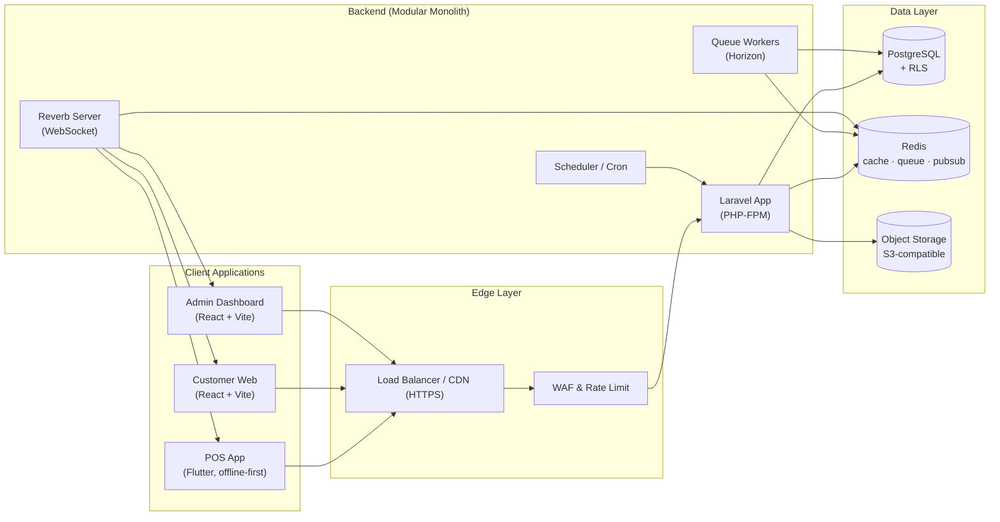

# System Architecture --- Dagana

> **Dokumen Teknis**
> **Modul:** System Architecture v0.1
> **Acuan:** PRD §6, §13, §14, §15, §20, §23, §29, §30; `docs/domain-modeling.md`, `docs/ERD.md`, `docs/API-Specification.md`, `docs/Authentication-RBAC.md`
> **Status:** Draft untuk implementasi Phase 0

---

## Table of Contents

1. [Tujuan & Prinsip](#1-tujuan--prinsip)
2. [Arsitektur Overall](#2-arsitektur-overall)
3. [Komponen Infrastruktur](#3-komponen-infrastruktur)
4. [Topologi Environment](#4-topologi-environment)
5. [Deployment & Containerization](#5-deployment--containerization)
6. [Realtime / WebSocket](#6-realtime--websocket)
7. [Antrian, Scheduler & Redis](#7-antrian-scheduler--redis)
8. [Object Storage](#8-object-storage)
9. [Database & Koneksi](#9-database--koneksi)
10. [Keamanan & Secrets](#10-keamanan--secrets)
11. [Monitoring, Logging & Backup](#11-monitoring-logging--backup)
12. [CI/CD](#12-cicd)
13. [Strategi Scaling](#13-strategi-scaling)
14. [Struktur Monorepo](#14-struktur-monorepo)
15. [Open Items](#15-open-items)

---

## 1. Tujuan & Prinsip

Mendokumentasikan bagaimana seluruh komponen (backend, PostgreSQL, Redis, WebSocket, object storage, klien) dikelola sebagai satu sistem yang dapat dijalankan di Phase 0 dan berkembang tanpa redesign besar.

Prinsip (PRD §24) yang diterapkan di level infrastruktur:

-   **Modular Monolith** — satu proses aplikasi, boundary domain tetap jelas.
-   **Realtime Ready** — WebSocket + Redis sejak awal.
-   **Offline Ready** — POS memiliki ID lokal + idempotency (infrastruktur sinkronisasi tidak membutuhkan server khusus).
-   *Scale-out* simulasi lewat proses yang dapat digandakan (app, worker, websocket).

---

## 2. Arsitektur Overall

### 2.1 Diagram (Production)



### 2.2 Alur Data Utama

-   **REST API** → `WEB` (validasi, auth, RBAC, RLS context) → PostgreSQL.
-   **Event internal** → Redis pub/sub → worker/Reverb menyebar ke klien via WebSocket.
-   **Transaksi checkout** → atomic dalam 1 DB transaction (PRD §13), lalu publish `OrderCreated`.
-   **Offline POS** → transaksi lokal dengan `Idempotency-Key`; sinkronisasi saat koneksi pulih (PRD §15).

---

## 3. Komponen Infrastruktur

| Komponen | Peran | Phase 0 (Dev) | Production |
|---|---|---|---|
| Web server | Terminasi TLS, static, reverse proxy | `nginx` (container) | CDN + ALB/nginx |
| App | Laravel (PHP-FPM) | Docker Compose | Container (K8s/managed) |
| Queue worker | Proses async (notifikasi, sync, report) | `horizon` worker | Sama, scale-out |
| Scheduler | Cron (`orders` cleanup, report summary) | `schedule:work` | K8s CronJob |
| Realtime | WebSocket server | Laravel Reverb | Reverb (scale via Redis) |
| PostgreSQL | Data utama | 1 instance | Managed PG + PgBouncer |
| Redis | Cache, queue, pub/sub, rate limit | 1 instance | Managed Redis |
| Object storage | Gambar produk, logo, receipt | MinIO | S3-compatible (R2/Spaces/S3) |
| Observability | Log, metrik, alert | loki/prometheus (opsional fase 6) | Managed |

---

## 4. Topologi Environment

| Environment | Tujuan | Cara jalan |
|---|---|---|
| `local` | Developer | Docker Compose penuh (`make up`); MinIO + Reverb aktif |
| `staging` | QA / integrasi | Preview deploy per PR, DB terpisah, data dummy |
| `production` | Layanan nyata | Managed infra, HTTPS, monitoring |

```
local:    compose up -d        # app + worker + reverb + pg + redis + minio + nginx
staging:  deploy per pull request (branch → preview subdomain)
prod:     CI/CD → build image → deploy (K8s/managed) → healthcheck → rollback otomatis
```

---

## 5. Deployment & Containerization

### 5.1 Image

-   Satu image backend berisi Laravel; proses berbeda hanya perbedaan command (`php-fpm`, `horizon`, `schedule`, `reverb`).
-   Image frontend (admin & customer web) — **static build** disajikan nginx/CDN, tidak perlu PHP.
-   Tag versi: `git sha` + env (`app:main-a1b2c3d`).

### 5.2 Pipeline Rilis (Ringkas)

```text
Feature branch
  → PR → CI (lint, test, build) → preview deploy (staging)
  → merge ke main → build image → migration DB (blue/green) → deploy
  → smoke test (healthcheck /healthz) → rollback jika gagal
```

> Migrasi: `php artisan migrate` dijalankan sebelum traffic baru (release window), dengan backup otomatis sebelum mulai.

---

## 6. Realtime / WebSocket

### 6.1 Pilihan

**Laravel Reverb** (native Laravel, skalabel via Redis) sebagai default.

-   Publikasi event: Laravel **Broadcasting** (Redis driver) → Reverb menerima dari Redis pub/sub.
-   Channel & otorisasi: `Presence/Private` dengan JWT access token (claims memuat `tenant_id`, `outlet_ids`).
-   Fallback: `pusher-compatible` protocol → mudah migrasi ke Pusher/Soketi jika kebutuhan berubah (Open Items).

### 6.2 Arsitektur Event

```text
App (domain event, mis. OrderCreated)
   → PublishEventOnQueue (worker)
   → Redis pub/sub
   → Reverb → push ke channel klien
```

Klien:

```text
wss://api.dagana.example/reverb
subscribe: private-tenant.{tenant_id}.outlet.{outlet_id}   (POS/Admin/Kitchen)
subscribe: private-order.{order_token}                     (Customer QR)
```

### 6.3 Struktur Event (Kontrak)

```json
{
  "event": "OrderCreated",
  "data": {
    "order_id": "uuid",
    "order_number": "POS-000142",
    "outlet_id": "uuid",
    "items": [ { "product_name": "Kopi Susu", "qty": 2, "modifiers": [] } ]
  },
  "timestamp": "2026-09-20T10:30:00Z"
}
```

> Payload `minified` (tidak memuat data sensitif finansial penuh) demi keamanan & bandwidth. Detail diambil via REST bila perlu.

---

## 7. Antrian, Scheduler & Redis

### 7.1 Queue (Horizon)

| Queue | Pemakai | Prioritas |
|---|---|---|
| `high` | Checkout events, payment | dijalankan segera |
| `default` | Notifikasi, report async | normal |
| `low` | Sync batch, cleanup | tidak mendesak |

### 7.2 Scheduler (Laravel `schedule`)

-   Generate `daily_sales_summaries` (reporting projection) setiap akhir hari.
-   Cek low stock → publish `LowStockAlert`.
-   Revoke session expired; cleanup queue lama.

### 7.3 Redis — Pemakaian (PRD §23)

| Fungsi | Key pattern |
|---|---|
| Cache permission RBAC | `perm:{tenant_id}:{role_id}` |
| Rate limit auth | `rl:login:{ip}` |
| Idempotency pendek (opsional) | `idem:{outlet_id}:{key}` |
| Pub/sub realtime | native Reverb |
| Distributed lock | `lock:stock:{variant_id}:{outlet_id}` (cek repo saat debit) |

---

## 8. Object Storage

| Use case | Bucket |
|---|---|
| Produk/kategori | `product-images` |
| Logo bisnis | `branding` |
| Receipt/template | `receipts` |
| Export report | `exports` |

-   **Format**: S3 API agar bebas provider (minio lokal, R2/S3/Spaces di prod).
-   **Akses**: private by default; file publik lewat signed URL (TTL).
-   Virus scan & resize: worker `low` saat upload produk (post-scaffold).

---

## 9. Database & Koneksi

-   **PostgreSQL** sebagai satu sumber kebenaran.
-   **RLS** aktif sesuai `Authentication-RBAC.md` §8: DB role `dagana_app` tanpa `BYPASSRLS`, `set_config('app.current_tenant_id')` per transaksi.
-   **Pooling**: PgBouncer (transaction mode) di production untuk optimasi koneksi POS burst.
-   **Backup**: `pg_dump` harian + WAL (PITR), retensi 30 hari; restore diuji berkala (fase 6).
-   Read replica: tidak wajib di MVP; ready di fase scaling.

---

## 10. Keamanan & Secrets

-   Secrets di **env vault** (GitHub Secrets / K8s Secret / SOPS), tidak pernah di repo.
-   HTTPS wajib; HSTS; cookie refresh token `httpOnly; Secure; SameSite=Lax`.
-   WAF + rate limit di edge (auth endpoint ketat).
-   Image signing & dependensi *lockfile* di CI.
-   Health endpoint `/healthz` tanpa info sensitif.

---

## 11. Monitoring, Logging & Backup

### 11.1 Observability

| Jenis | Tool | Metrik penting |
|---|---|---|
| APM/log | Sentry/Loki | error rate, exception |
| Metrik | Prometheus + Grafana | API latency p95, checkout duration, queue depth, WS connected |
| Uptime | UptimeRobot/Statuspage | `/healthz`, Reverb |

SLA target MVP: error rate < 1%, API latency p95 < 300 ms untuk operasi POS umum (PRD §20).

### 11.2 Backup & Disaster Recovery

-   DB: PITR + backup harian.
-   Object storage: versioning + cross-region replicate (jika memungkinkan).
-   RTO 4 jam / RPO 15 menit (target fase 6).

---

## 12. CI/CD

### 12.1 Pipeline (GitHub Actions)

```yaml
on:
  push:
    branches: [main]
  pull_request:
    branches: [main]

jobs:
  backend-test:
    - composer install
    - pint (style) + phpstan
    - pest/phpunit (sqlite/in-memory + Postgres service)
    - build image
  frontend-build:
    - npm ci (admin) / npm ci (customer-web)
    - typecheck + eslint + build
  deploy-staging:
    - needs: [backend-test, frontend-build]
    - deploy ke staging preview
  deploy-production:
    - needs: [backend-test, frontend-build]
    - hanya saat tag/release → migration → deploy → smoke test
```

### 12.2 Kualitas Gate

-   Wajib hijau: lint, tipe check, unit + integration test (checkout atomic, RLS isolation).
-   Coverage baseline minimal 70% pada modul Sales/Inventory (fase 6 dinaikkan).
-   Satu lintasan deployment ke produksi membutuhkan approval manual.

---

## 13. Strategi Scaling

| Tahap | Langkah |
|---|---|
| MVP (Phase 0–4) | 1 app + 1 worker + Reverb di host yang sama; Redis/PG managed |
| Growth | Pisah app & worker; tambah instance Reverb (Redis pub/sub menskalakan) |
| Lanjut | Read replica PG, cache side panel menu/book di Redis, K8s autoscaling |
| Pasca-monolith (PRD §2) | Pisahkan modul berat (Reporting) menjadi service tersendiri saat dibutuhkan |

> Prinsip `Modular Monolith` (PRD §24) memungkinkan ekstraksi bertahap tanpa menulis ulang dari nol.

---

## 14. Struktur Monorepo

```text
dagana/
├── apps/
│   ├── api/                 # Laravel Modular Monolith
│   │   ├── app/Modules/{Identity,Tenancy,Catalog,Inventory,Sales,Payments,
│   │   │                   Customers,Tables,Ordering,Notifications,Reporting}/
│   │   ├── database/migrations/
│   │   └── routes/
│   ├── admin-web/           # React + Vite + Tailwind + shadcn/ui (Admin Dashboard)
│   └── customer-web/        # React + Vite + Tailwind (QR Ordering)
├── docs/                    # Dokumentasi teknis (PRD, domain model, ERD, API, dll)
├── infra/
│   ├── docker/              # compose.yaml, Dockerfile, nginx conf
│   ├── gh-actions/          # workflow CI/CD
│   └── terraform/ (opsional, fase 6)
├── packages/                # shared contract (errors, DTO types) — post-scaffold
└── configs/
```

POS (Flutter) tetap repositori terpisah atau subfolder `apps/pos/` (Open Items) karena toolchain berbeda dan butuh build native.

---

## 15. Open Items

-   [ ] Deklarasi provider: object storage production (R2/Spaces/S3)
-   [ ] WebSocket: Reverb vs Pusher/Soketi (default Reverb)
-   [ ] Repositori POS (monorepo vs repo terpisah)
-   [ ] Managed vs self-hosted PostgreSQL/Redis di production
-   [ ] Strategi K8s vs Docker Compose untuk deployment awal produksi
-   [ ] Runner CI self-hosted vs GitHub-hosted
-   [ ] Lokasi & segmen VPC / firewall production

---

## Document Status

| Property | Value |
|---|---|
| Product | Dagana |
| Document | System Architecture |
| Version | v0.1 |
| Status | Draft untuk implementasi Phase 0 |
| Next Step | Scaffold Phase 0 (repo, Docker, auth, tenant, RLS, CI/CD baseline) |